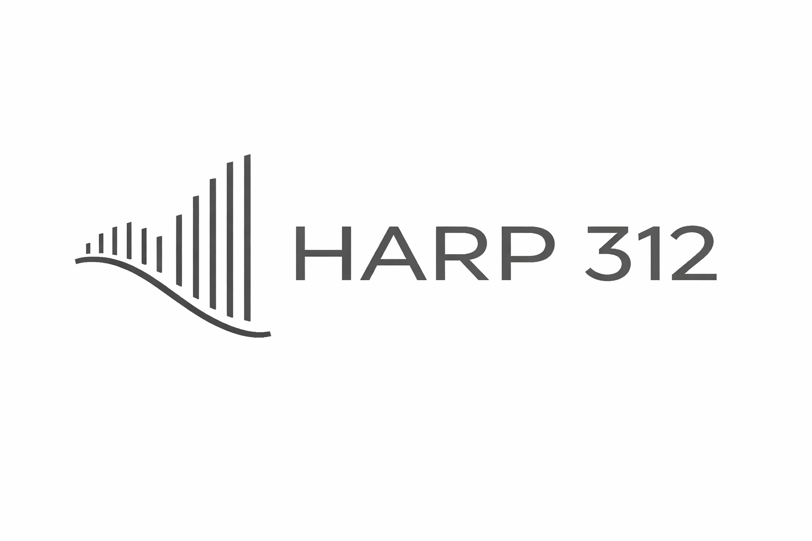
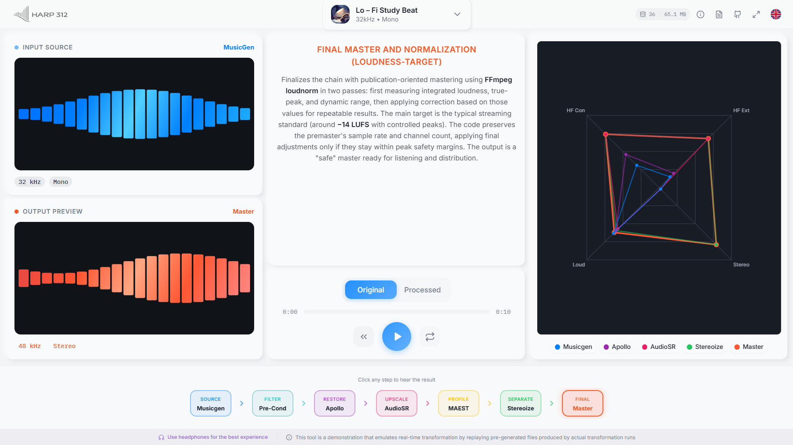

<!-- =======================================================
HARP 312 — README
Repo: https://github.com/rlpb/HARP-312
======================================================== -->

  

<h1 align="center">HARP 312</h1>

  <b>Hybrid Audio Restoration Process</b> 
  A pragmatic post-processing chain for improving <i>technical</i> and <i>perceptual</i> fidelity of <b>MusicGen</b> outputs 
  (restoration + bandwidth extension + mono-safe stereo synthesis + loudness-compliant mastering)

  
  
  

---

## Demo (web app)

  

- **Live demo:** https://harp312.netlify.app  
- The demo is meant for **inspection + qualitative playback**. Production-grade serving requires dedicated compute.

---

## What is HARP 312?

**HARP 312** (where *“312”* denotes the exploratory variant that set the project direction) targets typical fidelity issues in text-to-music generation by chaining:

1) **DSP pre-conditioning** (rumble/DC control + headroom)  
2) **Conservative restoration** with **Apollo**  
3) **Bandwidth extension** (audio super-resolution) with **AudioSR**  
4) **Style estimation** with **Discogs MAEST** (only to bias stereo parameters)  
5) **Mono-safe stereo synthesis** (controlled Mid/Side)  
6) **Loudness-normalized mastering** compliant with **BS.1770 / EBU R128**

> Scope: improve *fidelity* and *production readiness* (not prompt adherence).

---

## Pipeline (high level)

**Input:** MusicGen waveform  
**Output:** mastered stereo (mono-safe), loudness/true-peak compliant

- **Pre-conditioning (DSP):** 2nd-order Butterworth high-pass @ 25 Hz (zero-phase), peak headroom normalization (target -3 dBFS).
- **Apollo restoration:** chunked inference (e.g., 5 s chunks, 2 s overlap) used strictly as restoration.
- **AudioSR bandwidth extension:** diffusion SR in chunks (e.g., 6 s with 0.5 s overlap), stitched with crossfades, rendered at 48 kHz.
- **MAEST style estimation:** predicts a coarse top label mapped to a macro genre bucket; used only to bias stereo injection parameters.
- **Stereo synthesis:** controlled M/S widening with decorrelated, band-limited side content (bass-safe), transient damping and mono-compatibility guardrails.
- **Mastering:** two-pass loudness normalization (R128 / BS.1770), true-peak-safe.

---

## Notebooks (run in order)

> The pipeline is split across multiple Colab notebooks to reduce dependency conflicts (CUDA wheels + numpy/scipy/audio stack versioning) under **Colab-free** constraints.

### 1) MusicGen → Apollo (restoration)
  
**Notebook:** `notebooks/1_MusicGen_Apollo_HARP312.ipynb`

### 2) AudioSR (bandwidth extension)
  
**Notebook:** `notebooks/2_AudioSR_HARP312.ipynb`

### 3) Profiling (MAEST) → Stereoize → Mastering
  
**Notebook:** `notebooks/3_Profiling_Stereoize_Mastering_HARP312.ipynb`

### 4) Analysis & diagnostics (global + per-stage)
  
**Notebook:** `notebooks/4_Analysis_HARP312.ipynb`

---

## Evaluation (what we measure)

- Quick A/B listening (Audio-Technica ATH-M50X)  
- **Interpretable diagnostics** across checkpoints:
  - **HF extension** (energy above MusicGen Nyquist)
  - **M/S width**
  - **HF contrast** (penalizes quiet-frame HF residue)
  - **Loudness + true-peak compliance** (BS.1770 / R128)

> Speech-oriented metrics (PESQ/POLQA) and controlled MOS/MUSHRA panels are out of scope given infrastructure limits.

---

## Diagnostics gallery (proof figures)

All figures below are generated by the notebooks and stored in:
`readme_resource/notebooks_figures/`

### Global summary (end-to-end)

  
   <b>Global</b> — normalized indices across checkpoints (MusicGen → Apollo → AudioSR → Master).

 

  
   <b>Global</b> — average spectrum (Welch PSD), gain-matched in-band for fair comparison.

 

  
   <b>Global</b> — compact radar view + overall index.

---

### Stage-by-stage details (expand)

  
<b>MusicGen output</b>

   
  

    
     Baseline spectrogram of the raw MusicGen output.
  

  
<b>Pre-conditioning (DSP)</b>

   
  

    
     Low-frequency focus showing rumble/DC control and stabilization headroom.
  

  
<b>Apollo (restoration)</b>

   
  

    
     Output spectrogram after conservative restoration.
  

   
  

    
     Time–frequency difference (PRE vs POST) after bounded alignment and in-band gain matching.
  

   
  

    
     Average spectral residual (structural change emphasis).
  

   
  

    
     Distribution of spectral differences across frames/bands.
  

   
  

    
     Macro-band summary of restoration impact.
  

  
<b>AudioSR (bandwidth extension)</b>

   
  

    
     Output spectrogram after diffusion-based audio super-resolution.
  

   
  

    
     Average spectrum showing high-frequency extension.
  

   
  

    
     High-frequency delta spectrogram (extension region emphasis).
  

   
  

    
     In-band delta spectrogram (checks that in-band content stays conservative).
  

  
<b>MAEST profiling (style prior)</b>

   
  

    
     Discogs MAEST top probabilities used only to bias stereo parameters (no creative alteration).
  

  
<b>Stereo synthesis + mastering</b>

   
  

    
     Stereo injection profile (mono-safe, transient-safe design).
  

   
  

    
     Stereo field injection: width vs frequency (bass-safe widening).
  

   
  

    
     Mastering compliance: loudness + true-peak guardrails (BS.1770 / R128).
  

   
  

    
     Premaster vs Master: short-term loudness evolution.
  

   
  

    
     Micro-dynamics preservation: crest factor over time (sanity check against over-compression).
  

---

## References (core components)

- MusicGen — Copet et al. (2023)
- Apollo — JusperLee (GitHub)
- AudioSR — Liu et al. (2023)
- Discogs MAEST — MTG-UPF (Hugging Face)
- Loudness standards — ITU-R BS.1770 / EBU R128

(Full bibliographic entries are in the report / `references.bib`.)

---

## Notes & caveats

- This project is designed for **inspection and reproducible experimentation** in Colab.
- Chunking + overlap/crossfade are used to reduce boundary artifacts, but heavy content can still stress Colab VRAM.
- The stereo stage is **mono-safe by design**, but always check mono compatibility for your specific material.

---

## Links

- **Code + proof samples:** https://github.com/rlpb/HARP-312  
- **Demo:** https://harp312.netlify.app
